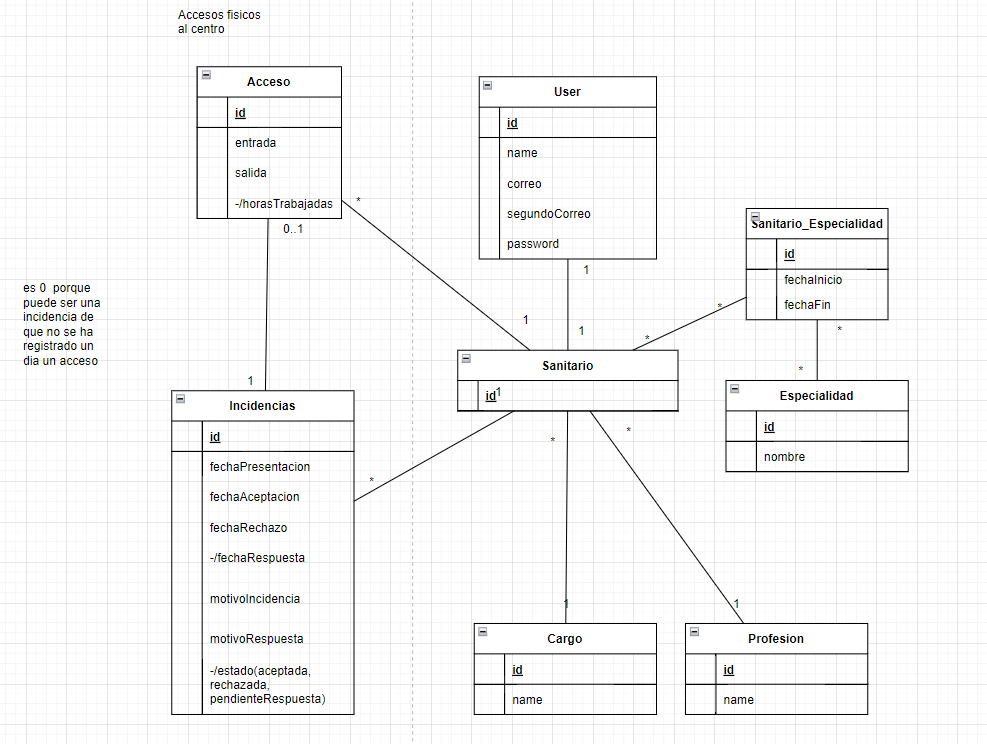

This project was developed for the Coding and Health Information Management (CGIS) course during my third year of studies. The main objective of the project is to design, model and develop a web application for managing the working hours of healthcare staff in a hospital. 

In general terms, for the normal roles of healthcare professionals, the application allows them to consult their access to the hospital and create incidents if they see any anomaly with the register. For the administration and responsibility roles, the application allows them to monitor and keep track of workers' compliance with their working hours and enables them to process any incidents that professionals raise when they see a problem with their access records.

In addition to this, the application allows functionalities common to all roles such as the creation of user accounts, the management of user profiles...



# Documentation
# Table of contents

1. [Problem_domain](#Problem_domain)
2. [Objectives](#Objectives)
3.[System_Users](#System_Users:) 4.
4. [Information_requirements:](#Information_requirements:)
5. [Functional_requirements:](#Functional_requirements:)
6. [Business_rules:](#Business_rules:)
7. [Non_functional_requirements:](#Non_functional_requirements:)
8. [Conceptual_UML_model](#Conceptual_UML_Model:) 

## Problem domain:

Currently the system governing the working hours of healthcare professionals is very complex. Events such as on-call duty, shift changes or rotations between centres are a daily occurrence in the sector. This makes the organisation of this system very difficult to manage and many of these events often go unrecorded.

## Objectives:

The objective of our system will be to provide professionals in the sector with a tool that will allow both management and healthcare professionals a form of management that effectively and efficiently solves the aforementioned problems. Facilitating the processes to a great extent and allowing the professionals themselves to play a leading role in these processes. The main objectives of our system will be:

**OBJ-1. Management of access to the hospital centre:**

One of the objectives of our system will be to carry out a control/monitoring of the accesses to the hospital centre by the healthcare staff. This will allow us to accurately record the number of hours worked by the professionals, avoid staff saturation, notify incidents in accesses, detect possible fraud...

**OBJ-2.Registration and management of incidences on the accesses of health personnel:** 

One of the objectives of our system will be to carry out a control of the accesses to the hospital centre by the health personnel by means of the use of incidences. Allowing to register the date of presentation of the incident, the date of the response, the status, the reason for presentation and response...

**OBJ-3. Registration and management of health personnel information:**

One of the objectives of our system will be to record and manage the information of healthcare personnel. Allowing the registration of personal information about professionals, about their speciality, position....

## Users of the system:

The types of users who will be able to access the system and make specific use of it will be:

Health professionals (doctors and nurses).

Management

Heads of duty.

Administrator

## Information requirements:

**RI-001. User information:** The system shall store personal data on all users. Primary and secondary email address, password and name.

**IR-002. Information on healthcare personnel:** The system shall store data on healthcare personnel. Type of profession (doctor and nurse), medical speciality and position within the hospital system (management, duty manager, regular healthcare).

**RI-003. Información sobre las especialidades médicas:** El sistema deberá almacenar datos sobre las especialidades médicas del personal sanitario. Nombre de especialidad (cardiología, radiología y pediatría).

**RI-003. Information on medical specialties:** The system shall store data on the medical specialties of health personnel. Name of speciality (cardiology, radiology and paediatrics).

**IR-004. Information on access to the health care centre:** The system shall record data on access to the health care centre by health care personnel. Date/time of entry, date/time of exit and number of hours worked in each day.

**IR-006. Information on incidents:** The system shall record data on incidents (regarding problems with access) reported by health personnel. Date/time of the incident, reason for the incident, access to which it refers, status of the incident (accepted, rejected, pending-response), reason for the response and the healthcare staff member making the response.

## Functional requirements:

**FR-001. User registration: (all roles)**.

We want the system to allow health professionals to register as users with a password and access the system.

**ACCESSES** 

**FR-002. Create access: (address, administrator)**

I want to be able to create access to health professionals that are compatible with my responsibility.

**FR-003. View my accesses: (all roles)**

I want to be able to consult my access history to the medical centre.

**FR-004. Consult my accesses: (on-call manager, management, administrator)**

I want to be able to consult the accesses of the medical staff that are compatible with my responsibility.

**FR-005. Consult in detail an access: (all roles)** ** I want to be able to consult in detail an access of the restrooms that are compatible with my responsibility.

I want to be able to consult in detail an access of my list of accesses.

**FR-006. Modify access: (address, administrator)**

I want to be able to modify the accesses of the health professional that are compatible with my responsibility.

**FR-007. Delete access: (address, administrator)**

I want to be able to delete access to the health professional that are compatible with my responsibility.

**FR-008. Filter access by dates: (all roles)**

I want to be able to filter my access history to the medical centre by date.

**INCIDENTS**

**FR-009. Create incident log: (healthcare professional, duty manager)**.

I want to be able to notify of any incident on the records of my accesses.

**FR-0010. Consult incidents: (management, administrator)**.

I want to be able to consult a list of the incidents of the medical staff.

**FR-0011. Query my incidents: (healthcare professional, head of duty, management, administrator)**

I want to be able to consult a list of my incidents. 

**FR-0012. Consult in detail incidents: (all roles)**.

I want to be able to consult in detail the incidents. 

**FR-0013. Modify incidents: (healthcare professional, duty manager)**

I want to be able to modify my incidents. 

**FR-0014. Delete incidents: (health professional)**.

I want to be able to delete my incidences on the records of my accesses.

**FR-015. Solve incidents: (management, administrator)**

I want to be able to approve or deny incidents by letting you know the reason for the resolution.

**HEALTH PROFESSIONALs**

**FR-0016. Create health professional: (address, administrator)**

I want to be able to create a new health professional.

**FR-0017. Consult health professional: (head of duty, management, administrator )**

I want to be able to consult a list of health professional that are compatible with my responsibility.

**FR-0018. Consult in detail health professional: (management, administrator )** ** I want to be able to see in detail the details of the health professional.

I want to be able to see in detail the details of a health professional.

**FR-0019. Consult in detail health professional: (head of duty, management, administrator)**

I want to be able to consult in detail a health professional in the list of health professional that are compatible with my responsibility.

**FR-0020. Modify health professional: (management, administrator )**

I want to be able to modify the details of a health professional.

**FR-0021. Delete health professional: (address, administrator )**

I want to be able to delete the data of a health professional.

**FR-0022**. Filter health professional by name: (head of duty, address, administrator)

I want to be able to filter by name the list of health professional that are compatible with my responsibility.

**FR-0023. Filter health professional by name: (address, administrator )**

I want to be able to filter the list of health professional by profession.

## Business rules:

**BR-001**.  Not specified

## Non-functional requirements:

**NFR-001. Security**: The system must be protected against unauthorised access.

**NFR-002. Performance**: The system must be able to handle the required number of users without any degradation in performance.

**NFR-003. Scalability**: The system must be able to scale up or down as required.

**NFR-004. Availability**: The system must be available when needed.

**NFR-005. Maintenance**: The system must be easy to maintain and upgrade.

**NFR-006. Portability**: The system must be able to run on different platforms with minimal changes.

**NFR-007. Reliability**: The system must be reliable and meet user requirements.

**NFR-008. Usability**: The system must be easy to use and understand.

**NFR-009. Compatibility**: The system must be compatible with other systems.

**NFR-010. Compliance**: The system must be compliant with all applicable laws and regulations.

The system must have an availability of 99.96%.

## UML Conceptual Model

