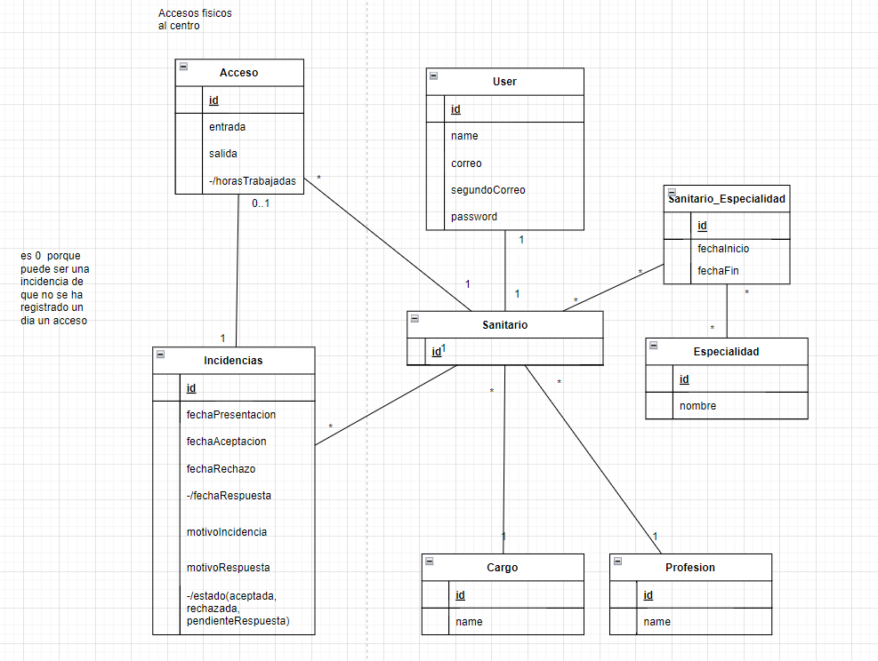


# Contenido
# Índice

1. [Dominio_del_problema](#1.Dominio_del_problema)
2. [Objetivos](#2.Objetivos)
3. [Usuarios_del_sistema:](#3.Usuarios_del_sistema:)
4. [Requisitos_de_información:](#4.Requisitos_de_información:)
5. [Requisitos_funcionales:](#5.Requisitos_funcionales:)
6. [Reglas_de_negocio:](#6.Reglas_de_negocio:)
7. [Requisitos_no_funcionales:](#7.Requisitos_no_funcionales:)
8. [Modelo_conceptual_UML](#8.Modelo_conceptual_UML:) 

## 1.Dominio del problema:

En la actualidad el sistema por el que se rigen las jornadas laborales de los profesionales sanitarios es muy complejo. Eventos como las guardias, los cambios de turnos o las rotaciones entre centros son el pan de cada día en el sector. Esto hace que la organización de este sistema sea muy difícil de gestionar y que en muchas ocasiones no se lleguen a registrar muchos de estos sucesos.

## 2.Objetivos:

El objetivo de nuestro sistema será capacitar a los profesionales del sector de una herramienta que les permita tanto a la dirección como a los profesionales sanitarios una forma de gestión que solvente eficaz y eficientemente la problemática anterior . Facilitando en gran medida los procesos y permitiendo que los propios profesionales tengan un papel protagonista en estos. Los principales objetivos de nuestro sistema serán:

**OBJ-1. Gestión de los accesos al centro hospitalario:**

Nuestro sistema tendrá como uno de sus objetivos llevar a cabo un control/seguimiento de los accesos al centro hospitalario por parte del personal sanitario. Permitiendo registrar con exactitud el número de horas ejercidas por los profesionales, evitar la saturación del personal, notificar incidencias en los accesos, detectar posibles fraudes…

**OBJ-2.Registro y gestión de incidencias sobre los accesos del personal sanitario:**

Nuestro sistema tendrá como uno de sus objetivos llevar a cabo un control de los accesos al centro hospitalario por parte del personal sanitario mediante el uso de incidencias. Permitiendo registrar la fecha de presentación de la incidencia, la fecha de la respuesta, el estado, el motivo de presentación y respuesta...

**OBJ-3. Registro y gestión de información del personal sanitario:**

Nuestro sistema tendrá como uno de sus objetivos llevar a cabo el registro y la gestión de la información del personal sanitario. Permitiendo registrar información personal sobre los profesionales, sobre su especialidad, cargo…

## 3.Usuarios del sistema:

Los tipos de usuarios que podrán acceder al sistema y hacer un uso específico de este serán:

Profesionales Sanitarios (médicos y enfermeros) .

Dirección

Jefes de guardia.

Administrador

## 4.Requisitos de información:

**RI-001. Información sobre los usuarios:** El sistema deberá almacenar datos personales sobre todos los usuarios. Dirección de correo electrónico principal y segundario, contraseña y nombre.

**RI-002. Información sobre el personal sanitario:** El sistema deberá almacenar datos del personal sanitario. Tipo de profesión (médico y enfermero), especialidad médica y cargo dentro del sistema hospitalario (Dirección, jefe de guardias, sanitario normal).

**RI-003. Información sobre las especialidades médicas:** El sistema deberá almacenar datos sobre las especialidades médicas del personal sanitario. Nombre de especialidad (cardiología, radiología y pediatría).

**RI-004. Información sobre los accesos al centro sanitario:** El sistema deberá registrar datos sobre los accesos al centro sanitario por parte del personal sanitario .Fecha/hora de entrada, fecha/hora de salida y número de horas trabajadas en cada joornada.

**RI-006. Información sobre incidencias :** El sistema deberá registrar datos sobre las incidencias (con respecto a problemas con los accesos) que notifiquen el personal sanitario. Fecha/hora en la que se realiza la incidencia, motivo de la incidencia, acceso a la que hace referencia , estado de la incidencia (aceptada, rechazada, pendienteRespuesta), motivo de la respuesta y sanitario que la realiza.

## 5.Requisitos funcionales:

**RF-001. Registro de usuarios: (todos los roles)**

Queremos que el sistema nos permita a los profesionales sanitarios registrarnos como usuarios con una contraseña y acceder al sistema.

**ACCESOS** 

**RF-002. Crear acceso: (direccion, administrador)**

Quiero poder crear accesos a los sanitarios que sean compatibles con mi responsabilidad.

**RF-003. Cosultar mis accesos: (todos los roles)**

Quiero poder consultar mi historial de accesos al centro médico.

**RF-004. Consultar accesos: (jefe de guardia, direccion, administrador)**

Quiero poder consultar los acceso de los sanitarios que sean compatibles con mi responsabilidad.

**RF-005. Consultar en detalle un acceso: (todos los roles)**

Quiero poder consultar en detalle un acceso de mis listado de accesos.

**RF-006. Modificar acceso: (direccion, administrador)**

Quiero poder modificar los accesos de los sanitarios que sean compatibles con mi responsabilidad.

**RF-007. Borrar acceso: (direccion, administrador)**

Quiero poder borrar accesos a los sanitarios que sean compatibles con mi responsabilidad.

**RF-008. Filtrar accesos por fechas: (todos los roles)**

Quiero poder filtrar por fechas mi historial de accesos al centro médico.

**INCIDENCIAS**

**RF-009. Crear registro de incidencias: (profesional sanitario, jefe de guardias)**

Quiero poder notificar de cualquier incidencia sobre los registros de mis accesos.

**RF-0010. Consultar incidencias: (direccion, administrador)**

Quiero poder consultar un listado de las incidencias de los sanitarios.

**RF-0011. Consultar mis incidencias: (profesional sanitario, jefe de guardias, direccion, administrador)**

Quiero poder consultar un listado de mis incidencias. 

**RF-0012. Consultar en detalle incidencias: (todos los roles)**

Quiero poder consultar en detalle las incidencia. 

**RF-0013. Modificar incidencias: (profesional sanitario, jefe de guardias)**

Quiero poder modificar mis incidencias. 

**RF-0014. Borrar incidencias: (profesional sanitario)**

Quiero poder borrar mis incidencia sobre los registros de mis accesos.

**RF-015. Solucionar incidencias: (direccion, administrador)**

Quiero poder aprobar o denegar a las incidencias haciendoles saber el motivo de la resolución.

**SANITARIOS**

**RF-0016. Crear sanitarios : (direccion, administrador )**

Quiero poder crear un nuevo sanitario.

**RF-0017. Cosultar sanitarios: (jefe de guardia, direccion, administrador )**

Quiero poder consultar un listado de los sanitarios que sean compatibles con mi responsabilidad.

**RF-0018. Consultar en detalle sanitarios : (direccion, administrador )**

Quiero poder ver en detalle los datos de un sanitario.

**RF-0019. Cosultar en detalle sanitarios: (jefe de guardia, direccion, administrador )**

Quiero poder consultar en detalle un sanitario del listado de los sanitarios que sean compatibles con mi responsabilidad.

**RF-0020. Modificar sanitarios : (direccion, administrador )**

Quiero poder modificar los datos de un sanitario.

**RF-0021. Borrar sanitarios : (direccion, administrador )**

Quiero poder borrar los datos de un sanitario.

**RF-0022. Filtrar sanitarios por nombre: (jefe de guardia, direccion, administrador )**

Quiero poder filtrar por nombre el listado de los sanitarios que sean compatibles con mi responsabilidad.

**RF-0023. Filtrar sanitarios por nombre: (direccion, administrador )**

Quiero poder filtrar por profesión el listado de los sanitarios .

## 6.Reglas de negocio:

**RN-001.  :** No especificadas

## 7.Requisitos no funcionales:

**RNF-001. Seguridad**: El sistema debe estar protegido contra el acceso no autorizado.

**RNF-002. Actuación**: El sistema debe poder manejar el número requerido de usuarios sin ninguna degradación en el rendimiento.

**RNF-003. Escalabilidad**: El sistema debe ser capaz de escalar hacia arriba o hacia abajo según sea necesario.

**RNF-004. Disponibilidad**: El sistema debe estar disponible cuando sea necesario.

**RNF-005. Mantenimiento**: El sistema debe ser fácil de mantener y actualizar.

**RNF-006. Portabilidad**: El sistema debe poder ejecutarse en diferentes plataformas con cambios mínimos.

**RNF-007. Fiabilidad**: El sistema debe ser confiable y cumplir con los requisitos del usuario.

**RNF-008. Usabilidad**: El sistema debe ser fácil de usar y comprender.

**RNF-009. Compatibilidad**: El sistema debe ser compatible con otros sistemas.

**RNF-010. Compliancia**: El sistema debe cumplir con todas las leyes y reglamentos aplicables

El sistema debe de tener una disponibilidad del 99,96%.

## 8.Modelo conceptual UML

