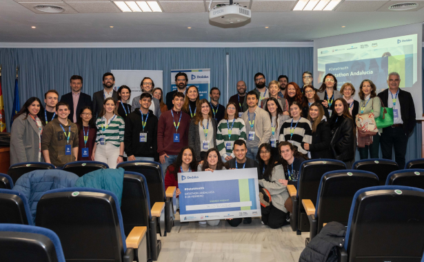
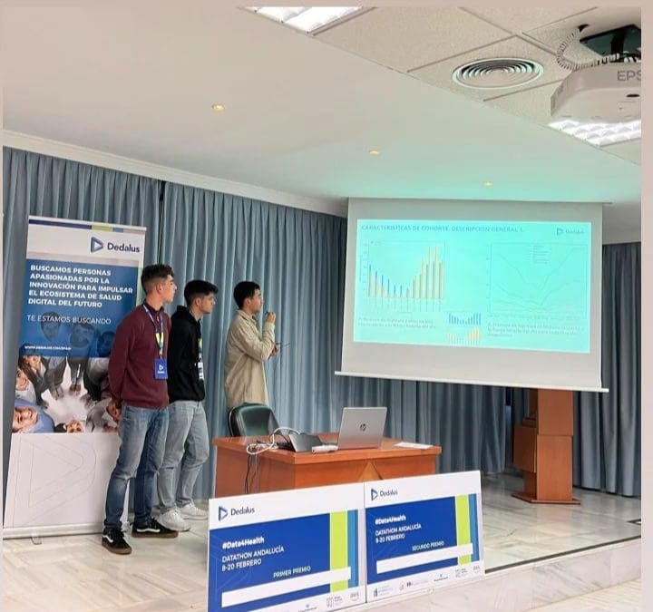

Este proyecto fue desarrollado durante mi tercer año de carrera para el Datathon organizado por Dedalus y AWS en Andalucía, en colaboración con dos compañeros de carrera. El principal objetivo de este datathon era trabajar con un conjunto de datos proporcionados sobre pacientes ingresados en Unidades de Cuidados Intensivos (UCI), para extraer valor clínico mediante análisis de cohortes y la creación de modelos predictivos. Se buscaba con este concurso generar información relevante para mejorar la eficiencia hospitalaria y optimizar la toma de decisiones en contextos clínicos.

## Análisis de Cohortes

El análisis de cohortes fue uno de los pilares fundamentales del proyecto, ya que nos permitió identificar patrones clave entre los pacientes hospitalizados. 

Realizamos un **análisis específico sobre pacientes con problemas cardiovasculares**. Este análisis incluyó varios aspectos importantes:

- El porcentaje de casos en función del género, que nos ayudó a identificar posibles diferencias en la prevalencia de los problemas cardiovasculares entre hombres y mujeres.
- La distribución de casos en relación con la edad, lo que permitió obtener un panorama claro sobre las franjas etarias más afectadas.
- El número de casos según el índice de masa corporal (IMC), que proporcionó una perspectiva sobre cómo el IMC influye en la incidencia de estas patologías.
- El porcentaje de mortalidad en función del IMC, revelando posibles correlaciones entre el peso corporal y los desenlaces fatales en pacientes con problemas cardiovasculares.

Realizamos un **análisis de cohortes más general** para todos los pacientes ingresados en la UCI. Este estudio incluyó:

- El número de ingresos y altas en la UCI en distintas franjas horarias, lo que proporcionó información sobre los momentos del día en los que se producían más admisiones.
- La tasa de mortalidad de los pacientes en función del diagnóstico, arrojando luz sobre cuáles eran las patologías más críticas en términos de supervivencia.
- El tiempo de estancia en UCI según cada diagnóstico, lo que facilitó la identificación de los tratamientos y patologías que requerían mayor tiempo de hospitalización.

## Comparativa de Hospitales

Otro aspecto destacado del proyecto fue el análisis comparativo entre diferentes hospitales. En este análisis, evaluamos el rendimiento de los hospitales en función de su capacidad para tratar patologías críticas, utilizando la mortalidad como indicador clave. Este análisis nos permitió comparar la eficiencia de los hospitales en el tratamiento de ciertos diagnósticos y patologías, además de explorar el tiempo medio de estancia en la UCI por cada hospital. Con esta información, pudimos identificar posibles áreas de mejora en la gestión hospitalaria y la atención clínica en diferentes centros de salud.

## Modelos Predictivos

Como parte del proyecto, también desarrollamos modelos predictivos con el fin de anticipar comportamientos y mejorar la planificación en las UCI. Uno de los modelos principales fue el de **control de la congestión en las UCI, que tenía la capacidad de predecir cuándo se alcanzarían niveles críticos de ocupación y así anticiparse a posibles cuellos de botella en la atención hospitalaria**.

Además, diseñamos **modelos que podían predecir la duración de la estancia de los pacientes en la UCI**, clasificándolos en estancias cortas, medias o largas. Estos modelos predictivos no solo permitieron optimizar la asignación de recursos hospitalarios, sino que también contribuyeron a una mejor planificación de las altas médicas y a la reducción de tiempos de espera.

Presentación: [**Visualizar presentación en pdf**](/post/datathon/ATENAS_Datathon_Dedalus.pdf)