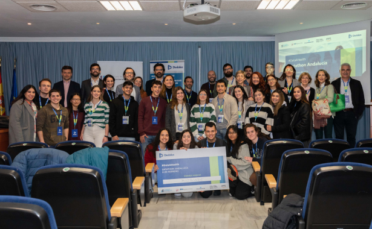
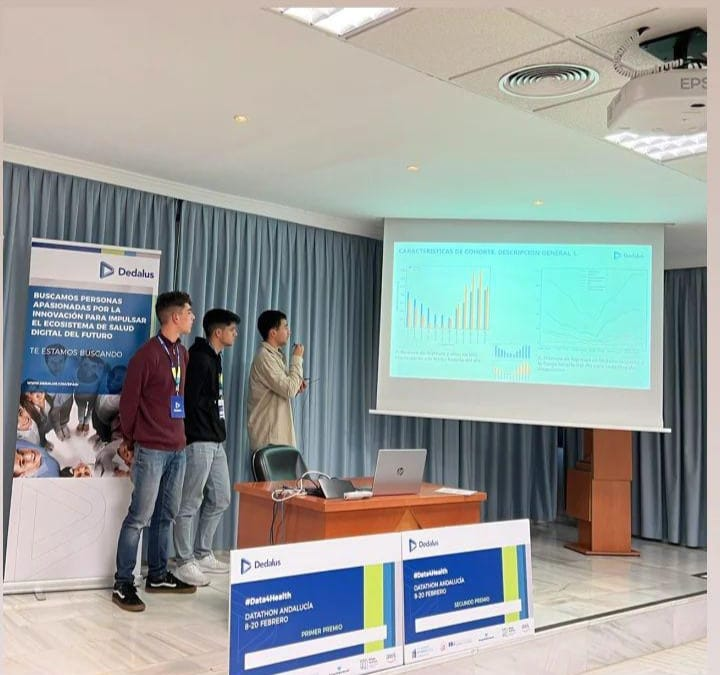

This project was developed during my third year of career for the Datathon organized by Dedalus and AWS in Andalusia, in collaboration with two fellow students. The main objective of this datathon was to work with a dataset provided on patients admitted to Intensive Care Units (ICU), to extract clinical value through cohort analysis and the creation of predictive models. The aim of this competition was to generate relevant information to improve hospital efficiency and optimize decision making in clinical contexts.

## Cohort analysis

Cohort analysis was one of the fundamental pillars of the project, as it allowed us to identify key patterns among hospitalized patients. 

We performed a **specific analysis on patients with cardiovascular problems**. This analysis included several important aspects:

- The percentage of cases according to gender, which helped us to identify possible differences in the prevalence of cardiovascular problems between men and women.
- The distribution of cases in relation to age, which allowed us to obtain a clear picture of the age groups most affected.
- The number of cases according to body mass index (BMI), which provided a perspective on how BMI influences the incidence of these pathologies.
- The percentage of mortality according to BMI, revealing possible correlations between body weight and fatal outcomes in patients with cardiovascular problems.

We performed a **more general cohort analysis** for all patients admitted to the ICU. This study included:

- The number of ICU admissions and discharges in different time slots, which provided information on the times of day when more admissions occurred.
- The mortality rate of patients according to diagnosis, shedding light on which were the most critical pathologies in terms of survival.
- The length of stay in ICU according to each diagnosis, which facilitated the identification of treatments and pathologies that required longer hospitalization time.

## Hospital Comparison

Another highlight of the project was the comparative analysis between different hospitals. In this analysis, we evaluated the performance of hospitals in terms of their capacity to treat critical pathologies, using mortality as a key indicator. This analysis allowed us to compare the efficiency of hospitals in the treatment of certain diagnoses and pathologies, in addition to exploring the average length of stay in the ICU for each hospital. With this information, we were able to identify possible areas for improvement in hospital management and clinical care in different health centers.

## Predictive Models

As part of the project, we also developed predictive models in order to anticipate behaviors and improve planning in ICUs. One of the main models was **ICU congestion monitoring, which had the ability to predict when critical occupancy levels would be reached and thus anticipate potential bottlenecks in hospital care**.

In addition, we designed **models that could predict the length of stay of patients in the ICU**, classifying them into short, medium or long stays. These predictive models not only allowed us to optimize hospital resource allocation, but also contributed to better discharge planning and reduced waiting times.

Presentation: [**View presentation in pdf**](/post/datathon/ATENAS_Datathon_Dedalus.pdf)
