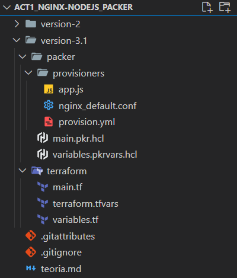

Este proyecto fue desarrollado para la asignatura de Herramientas DevOps, como parte del máster universitario oficial en Desarrollo y Operaciones (DevOps).

El objetivo del proyecto es **crear y desplegar de forma automática una imagen de un sistema web completo en un entorno multicloud de Azure y AWS**. Este sistema web se compone de una pequeña aplicación escrita con Nodejs y un servidor web Nginx. Para conseguirlo, utilizo las tecnologías de Terraform, Ansible y Packer principalmente. 

### Tecnologías utilizadas:

- **Terraform:** Con Terraform centralizo todo la ejecución del proceso y despliego la infraestructura necesaria para levantar una instancia en la nube creada a partir de la imagen del sistema y accesible a través de internet. 
- **Packer:** Con Packer construyo la imagen del sistema completo. Packer utiliza como proveedor para la creación de la imagen la cloud. Levanta una instancia y toda la infraesturctura necesaria para la creación de la imagen y cuando termina las destruye.
- **Ansible:** con ansible se lleva a cabo el aprovisionamiento de la instancia que levanta packer y a partir del cual se crea la imagen. En el caso de Azure este aprovisionamiento lo hago con Ansible, en el caso de AWS hago lo mismo pero directamente con scripting de Bash.

### Proceso de creación y despliegue:

La secuencia de pasos del proceso sería la siguiente: 
1. Inicializar ejecutando manualmente en la shell un `terraform init && terraform apply`
2. Tras ello, terraform ejecuta el comando `packer build` que se encarga de levantar toda la infraesturctura necesaria y la máquina que utilizá para la creación de la imagen. En el caso de Azure, en esta máquina se instala un Ansible y este se autoaprovisiona ejecutando un playbook y una serie de task definidos en él. En el caso de AWS, se ejecutan los mismos pasos pero en vez de con un Ansible directamente de forma manual con un scripting en Bash. El aprovisionamiento se basa entre otras cosas en la instalación y gestión de los servicios: Nodejs, Nginx, pm2 y App.js en la instancia que crea la imagen.
- **Nodejs:** Proporciona un entorno con todo lo necesario para que la aplicación ejecute y funcione correctamente.
- **Nginx:** servidor web que se encargará de redirijir todo el tráfico a la aplicación y de reenviar sus respuestas. Muy importante su configuración para que cuando se despliegue la iamgen el servidor esté activo y correctamente configurado para que sirva a la app. Pasa el tráfico del puerto 80 al 3000 (donde escucha la app.js)
- **PM2:** gestor de procesos de Nodejs que sirve para asegurar que la app.js esté activa cuando se despliegue la imagen sin tener que hacer nada más. (especialmente delicada este paso).
- **App.js**: aplicación central y funcional de la imagen, es importante trasferir el código fuente de la app para que sea accesible por la instancia que crea la imagen.

3. Tras esto, Packer crea la imagen y destruye toda la infraestructura que ha necesitado levantar en el proveedor correspondiente de cloud. 
4. Terraform tras esperar que la creación de la imagen finalice correctamente, levanta toda la infraestructura necesaria (par de claves, grupo de seguridad, disco...) para levantar una instancia a partir de esta imagen.
5. Una vez terminado el despliegue, está instancia es accesible a través de internet a raiz de la ip pública.

En definitiva, solo ejecutando un: `terraform init && terraform apply` despliegas todo un entorno web funcional y accesible desde internet en la nube pública de Azure y AWS. Y además creas una imagen reutilizable para poder desplegar más instancias idénticas a estas en un futuro de una forma mucho más rápida y seguro ante posibles errores humanos.

**Repositorio de GitHub:** https://github.com/aleingmar/CreateImages_Nginx-Nodejs_Packer

### Contenido del repositorio y ficheros del proyecto:

El repositorio de GiHub se compone de dos directorios principales con dos versiones distintas: `/version-2` y `/version-3.1`
El directorio totalmente funcional y que contiene la ultima version del proyecto es el segundo (`/version-3.1`). Este es el directorio donde hay que ubicarse para desplegar el `terraform init && terraform apply` (`cd version-3.1/te*`).

Explicando brevemente el contenido del directorio:
- `/packer/`: directorio donde se encuentra todo el contenido necesario para la ejecución de Packer y para que pueda construir la imagen.
    - `/packer/main.pkr.hcl`: fichero principal de Packer donde se definen todos los recursos necesarios para contruir la imagen asi como defino todas las variables que van a utilizar.
    - `/packer/variables.pkrvars.hcl`: fichero donde les asigno valores a todos las variables definidas en el `main.pkr.hcl` menos a las credenciales de las dos nubes que por seguridad, las defino y asigno valores como variables de entorno de mi sistema operativo del host que utilizo para lanzar el terraform. Estos valores los paso como parámetros en el comando de `terraform apply` y `packer build`.
    - `/packer/providers/`: directorio donde podemos encontrar los ficheros auxiliares que sirven para crear la imagen como pueden ser, el fichero de configuración de apache (`nginx_default.conf`), el playbook que define el aprovisionamiento con ansible (`playbook.yml`) y el código de la aplicación de nodejs (`app.js`). 
- `/terraform/`: directorio donde se encuentra todo el contenido necesario para la ejecución de terraform y para que pueda desplegar toda la infraesturtura necesaria para el proyecto.
    - `/terraform/main.tf`: fichero principal de terraform, donde se define todo el flujo de proceso que debe seguir el despliegue y toda la infraestrutura a levantar.
    - `/terraform/variables.tf`: fichero donde se definen todas las variables utilizadas por terraform.
    - `/terraform/terraform.tfvars`: fichero donde se les da valor a todas las variables menos a las credenciales de las dos nubes que por seguridad, las defino y asigno valores en variables de entorno de mi sistema operativo del host desde donde lanzo el terraform. Estos valores los paso como parámetros en el comando de `terraform apply` y `packer build`.

### Contenido del Packer main:

El contenido de este fichero se puede diferenciar en varias partes en las cuales se definen los siguientes componentes necesarios para la creación de la imagen:
- **PLUGINS**: Define los plugins necesarios para la plantilla.
- **Definición de variables**: (no se les asigna valor aquí, solo alomejor el de por defecto)

- **BUILDER**: Define cómo se construye la AMI en AWS --> `source{}`--> define el sistema base sobre el que quiero crear la imagen (ISO ubuntu) y el proveeedor para el que creamos la imagen (tecnologia con la que desplegará la imagen) --> AMAZON. AZURE
- **PROVISIONERS**: Configura el sistema operativo y la aplicación, como se va instalar y configurar el software --> `build{}` 

### Vídeo de la experimentación:


