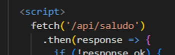
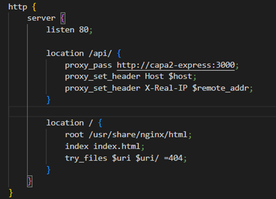

Este proyecto fue desarrollado para la asignatura de Contenedores como parte del máster universitario oficial en Desarrollo y Operaciones (DevOps).
El objetivo principal del presente proyecto es llevar a cabo la dockerización de un aplicativo multicapa de carácter sencillo, diseñado con un enfoque pedagógico para ilustrar la arquitectura por capas y su despliegue mediante contenedores. Esta aplicación se ha concebido con tres capas diferenciadas: presentación web, lógica de negocio y persistencia de datos.
A pesar de que inicialmente se planteó un stack de tipo MEAN (Mongo - Express – Angular - Node), la capa de presentación basada en Angular y Nginx no ha sido implementada en su totalidad. Por ello, la estructura final del proyecto queda configurada de la siguiente manera:

•	Primera capa, capa de presentación: Nginx + Sitio web

•	Segunda capa, capa de lógica de negocio: Aplicación app.js desarrollada utilizando Express sobre Node.js.

•	Capa de persistencia: Implementada mediante MongoDB.

La funcionalidad del aplicativo es deliberadamente simple, con el objetivo de centrarse en la estructura y el despliegue. Se trata de una especie de "Hola Mundo", en la que el cliente se conecta inicialmente a la capa de presentación (Nginx), que le entrega un fichero index.html. 
Este fichero contiene una llamada que provoca una segunda petición HTTP al mismo servidor Nginx, pero que es procesada de forma distinta en función del PATH de la solicitud. 

Esta petición es redirigida hacia la capa de backend, donde se encuentra desplegada la aplicación Express.

Desde allí, la aplicación trata de establecer conexión con la base de datos MongoDB. 

En función del resultado de dicha conexión, el backend responde al cliente con un mensaje en formato JSON, indicando si la conexión ha sido exitosa ("Hola mundo, conexión establecida correctamente") o si ha ocurrido algún error. 

**Repositorio de GitHub:** 
https://github.com/aleingmar/multi-layer-app-dockerisation

## Vídeo de la experimentación y memoria del proyecto:
Documentación del proyecto: [**Visualizar documentación en pdf**](/post/multicapa-dockerizacion/Act1_Dockerizacion_AlejandroIngles.pdf)



