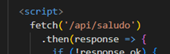
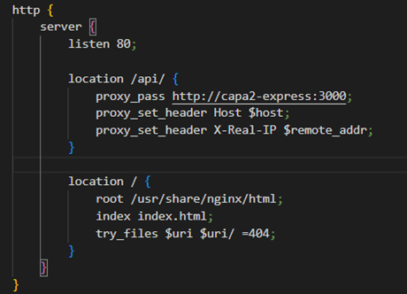
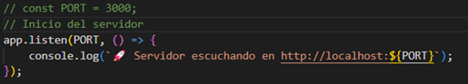
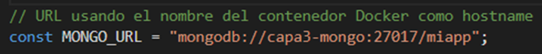
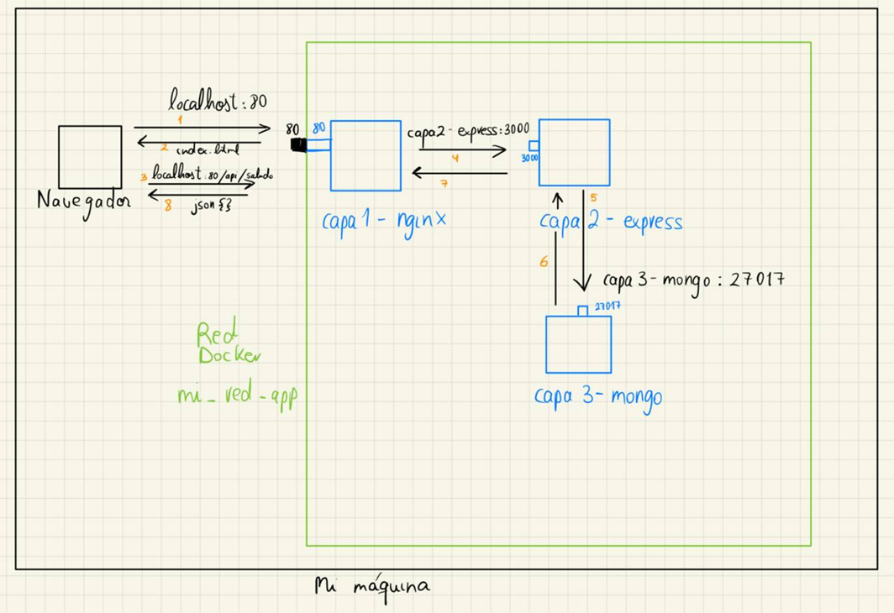

This project was developed for the Containers subject as part of the official university master's degree in Development and Operations (DevOps).
The main objective of this project is to dockerise a simple multilayer application, designed with a pedagogical perspective to illustrate the layered architecture and its deployment using containers. This application has been designed with three different layers: web presentation, business logic and data persistence.
Although a MEAN (Mongo - Express - Angular - Node) stack was initially considered, the presentation layer based on Angular and Nginx has not been fully implemented. Therefore, the final structure of the project is configured as follows:

- First layer, presentation layer: Nginx + Website

- Second layer, business logic layer: App.js application developed using Express on Node.js.

- Persistence layer: Implemented using MongoDB.

The functionality of the application is deliberately simple, with the aim of focusing on structure and deployment. It is a kind of ‘Hello World’, where the client initially connects to the presentation layer (Nginx), which delivers an index.html file. 
This file contains a call that triggers a second HTTP request to the same Nginx server, but which is processed differently depending on the PATH of the request. 

This request is redirected to the backend layer, where the Express application is deployed.

From there, the application tries to establish a connection to the MongoDB database. 

Depending on the result of that connection, the backend responds to the client with a message in JSON format, indicating if the connection was successful (‘Hello world, connection successfully established’) or if an error occurred. 

**GitHub repository:** 
https://github.com/aleingmar/multi-layer-app-dockerisation

## Experimentation video and project memory:
Documentation of the project: [**View documentation in pdf**](/post/multicapa-dockerizacion/Act1_Dockerizacion_AlejandroIngles.pdf)

