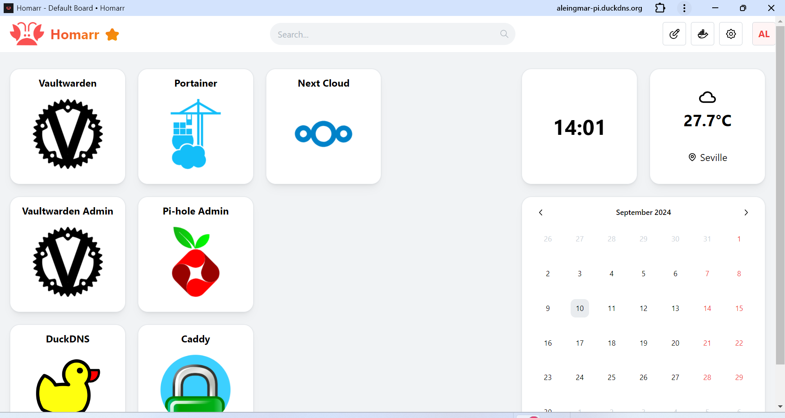
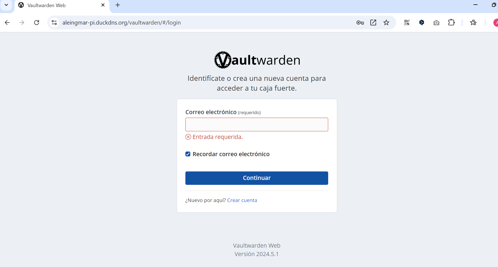
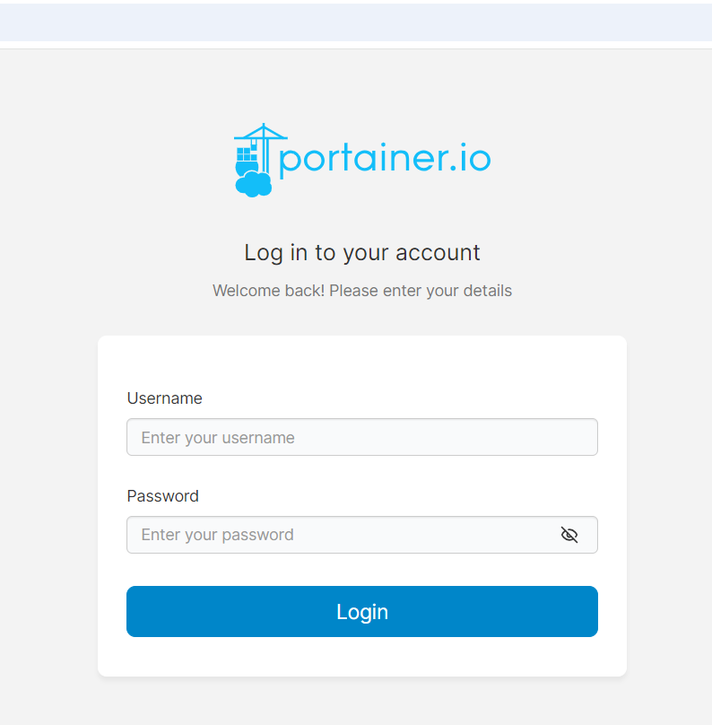
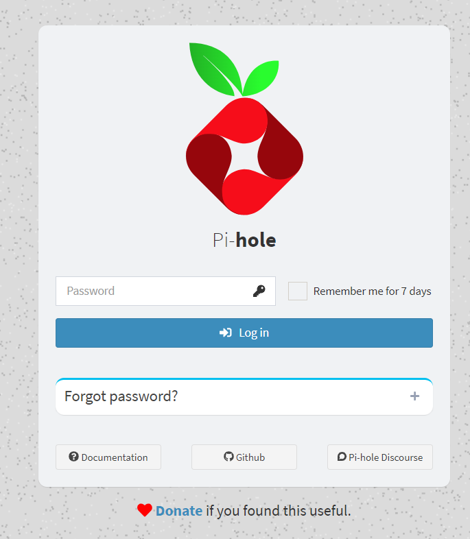

Este proyecto consiste en conseguir alojar y gestionar de forma autónoma determinados servicios en mi propio servidor, una RasberryPi 5 de 8gb de Ram. 

Para la administración y configuración tanto del servidor como de sus servicios alojados, accedo de forma remota a través del protocolo SSH.

El servidor está asociado a un dominio principal gestionado por **DuckDNS**, lo que me permite acceder a los servicios de manera remota a través del navegador. Para evitar que la IP dinámica de mi red doméstica cambie y pierda el acceso al servidor cuento con un servicio que de forma autónoma actualiza automáticamente cada 5 minutos esta ip, asegurando que siempre esté correctamente sincronizada.

Para organizar los accesos mediante subdominios y asegurar la conexión a mis servicios mediante **HTTPS**, utilizo **Caddy** como servidor web, que actúa como intermediario y maneja los certificados TLS/SSL, garantizando un acceso seguro y sin complicaciones.

Además, he implementado un panel de control avanzado llamado **Homarr**, que me proporciona una interfaz centralizada desde la cual puedo iniciar sesión y acceder fácilmente a los diferentes servicios desplegados en el servidor. 

Todos los servicios alojados en el servidor incluyendo los mencionados anteriormente se alojan mediante **contenedores Docker** y se organizan en subdominios específicos.
En el momento que escribo esto, los servicios no mencionados que aloja el servidor son:

- **Vaultwarden**: Un gestor de contraseñas.
- **Portainer**: Un gestor de contenedores con interfaz web.
- **Pi-hole**: Un servicio de DNS bloqueador de anuncios.
- **WireGuard**: Un servicio VPN.

WireGuard está integrado con Pi-hole. Esta configuración me permite no solo redirigir mi tráfico a través de mi servidor para asegurar mi conexión, sino también disfrutar de una navegación libre de anuncios, independientemente de dónde me encuentre.

 

 
