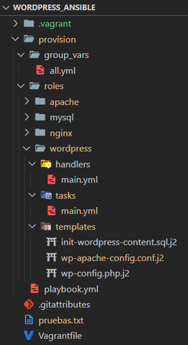

This project was developed for the Deployment Automation Tools course as part of the official university master's degree in Development and Operations (DevOps).

The main objective of the project was to **automate the local deployment of a complete WordPress environment** using **Ansible and Vagrant**. An optimised secure architecture was implemented using **Nginx as a reverse proxy** that blocks traffic destined for certain sensitive Wordpress administration paths.

Vagrant creates and raises the virtual machine, on which Ansible is installed. Ansible then automatically self-provisions and configures all the necessary services, including Apache, MySQL, WordPress and Nginx, leaving the system completely ready for use.

## General structure of the Anisble provisioning project

The following is the organisation of the Ansible files and roles, to make it easier to understand the general operation of the project:

### Main playbook: provision/playbook.yml.
This file acts as the starting point for Ansible. From here, the roles needed to configure all the components of the environment are included.
In this case, the code is divided into four roles: apache, mysql, wordpress and nginx, which are executed in this order.
The installation of PHP and its modules has been decided to be included directly in this playbook, instead of creating a separate role, as it is only a few lines of code.
The order of provisioning is as follows:
1. PHP modules
2.	Apache
3. MySQL
4. WordPress
5.	Nginx

### Variable management with Ansible
Instead of using Hiera as with **Puppet**, Ansible uses **YAML files** inside the `group_vars/all.yml` directory, allowing variables to be separated from the main code.
This ensures a more secure approach, avoiding exposing sensitive credentials when uploading the project to a repository. Although this project is academic and does not include encrypted variables, Ansible Vault allows you to encrypt variables if necessary.
- Variables are declared in: `group_vars/all.yml`.
- Jinja2 (.j2) templates are used to inject dynamic values into the configuration files.

### Roles in Ansible

To better organise the manifests and auxiliary files that Ansible needs for infrastructure configuration automation, I split the content into **four main roles in Ansible**, each responsible for a part of the system. This allows for **modularity, code reuse and better organisation** of the playbook.

#### Apache Role
With this role, Ansible installs and configures the Apache web server, which acts as a backend to serve WordPress. Apache is only accessible from the virtual machine itself, as Nginx will act as a reverse proxy.

The main tasks it performs are:
- Install Apache and make sure the service is active.
- Remove the default Apache page.
- Configure Apache to listen on **127.0.0.1:8080**.
  - Setting the listening port to **127.0.0.1:8080** means that **Apache will only accept connections from local processes on the same machine** where it is running. **The address 127.0.0.1 is the loopback (localhost) address**, which prevents access from other machines on the network. This is useful when Apache is behind a reverse proxy, such as Nginx, which handles external connections and forwards requests to Apache on port 8080.’
- Copy the custom configuration from a Jinja2 template (`wp-apache-config.conf.j2`).
- Enable the new site and restart Apache automatically.

With this configuration, Apache is kept isolated from shortcuts, ensuring that it can only be queried through Nginx.

#### MySQL Role
In this role Ansible provisions the virtual machine with a MySQL database to ensure proper storage and access to WordPress data. 

The main tasks it performs are:
- Install the MySQL server.
- Create the necessary database for WordPress.
- Configure the user and assign the appropriate permissions.
- Execute an initialisation script (`init-wordpress.sql.j2`) to prepare the database with the initial structure and data.

This role ensures that the database is ready and properly configured before WordPress attempts to connect later by running its role.

#### WordPress Role
This role automates the installation and configuration of WordPress, ensuring a functional and ready-to-use deployment.

Key tasks it performs include:
- Downloading and extracting WordPress into /var/www/html/wordpress.
- Create and configure the wp-config.php file using a template (`wp-config.php.j2`).
- Ensure correct permissions for WordPress (`chown -R www-data:www-data`).
- Install wp-cli and use it to configure WordPress automatically.
- Initialise the database with minimal content using `init-wordpress-content.sql.j2`.
- Configure Apache to serve WordPress content.

With this role, WordPress is installed, automatically configured and ready for use, without any manual intervention.

#### Nginx Role
This role implements **Nginx as a reverse proxy**, forming the first layer of defence of the system. Its main function is to handle incoming requests and block unwanted access.

The main actions performed are:
- Install Nginx in the virtual machine.
- Configure Nginx as a reverse proxy, redirecting requests to Apache on port 8080.
- Block access to sensitive paths such as `/wp-admin` and `/wp-login.php` to increase security.
- Optimise delivery of static files (CSS, JS, images) directly from Nginx, improving performance.
- Disable the default Nginx page and enable a WordPress-specific configuration.
- Restart Nginx automatically after applying the configuration.

**Why is Nginx important in this project?**

- Protects Apache by acting as a single external access point, preventing direct attacks.
- Improves security by blocking access to critical management paths.
With this configuration, Nginx filters traffic and only allows secure requests to WordPress, strengthening the system infrastructure.

## System architecture

### **Request processing and data flow**
When a user accesses WordPress, the request follows the following flow:

1. **The user accesses WordPress from a browser**.
2. **Nginx receives the request on port 80** and decides whether to block the request or forward it to Apache.
3. **If the request is valid**, Nginx forwards it to **Apache on `127.0.0.1:8080`**.
4. **Apache processes the request**, executing the WordPress PHP scripts.
5. **If the page requires database data,** Apache queries MySQL.
6. **Apache returns the generated response to Nginx**.
7. **Nginx sends the response to the user**.

This ensures that **Apache is only accessible from the machine itself**, while Nginx acts as the first line of defence.

**Communication between Nginx and Apache**.
To better understand how the two servers connect, it is important to know how their **ports and IPs** work:

- **Nginx listens on `0.0.0.0.0:80`**, which means it accepts connections to port 80 and to any IP that identifies the machine running it.  
- **Apache listens on `127.0.0.1:8080`**, which means that this process can only communicate with other processes from the same machine that send traffic to that ip and port 8080.  
  - **127.0.0.1 is the loopback address**, used for internal communication within the same machine.  
- **External traffic never reaches Apache directly**, as Nginx acts as an intermediary.
- **Key benefit:** If someone tries to access Apache directly from another machine, the connection will be rejected because **Apache is not exposed to the network**.
 
## Conclusion

All in all, simply by going to the console in the directory where the **Vagrantfile** is located and running a simple `vagrant up`, a functional, customised and secure WordPress environment is automatically deployed, accessible from a web client at `http://192.168.55.10`.

**GitHub repository:** 
https://github.com/aleingmar/Powershell-Scripting

## Experimentation video and project report:
Project documentation: [**View documentation in pdf**](/post/powershell-scripting/PowershellScripting.pdf)

