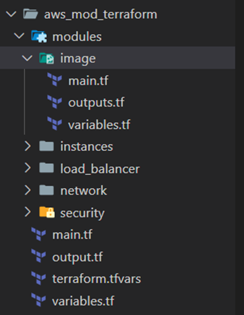

This project was developed for the DevOps Tools course, as part of the university's master's degree in Development and Operations (DevOps).

The aim of the project was to automatically deploy a fully functional multi-tier MEAN system in the AWS cloud. This system consists of a load balancer, several instances for the web application and a dedicated instance for the MongoDB database. I use Terraform, Packer and Ansible for infrastructure automation and provisioning.

On a personal level, I consider it important to highlight that the documentation report of this project is particularly complete, as it includes all the details of the development process. Among them, I had to deal with three main problems during this process. Without going into too much detail, these were:

1. Deployment on Azure, version incompatibility and choice of AWS.
2. Execution of an interactive command blocking the automatic provisioning process.
3. Static resource inconsistency and balancer logoff.

In my opinion, these problems are very interesting to analyse, as they are common situations in this type of work. Although they may seem minor, they have been fundamental in the development of the project.

It is also worth mentioning that for this project I have used similar technologies to those of the project **‘Creation and automated deployment of image in multicloud environment’**, which is also available in my portfolio. For this reason, in this publication I have decided to highlight three aspects that differentiate both works:

- The use of the MEAN stack.
- The modularisation of Terraform.
- The deployment process and architecture, although the latter is presented in a summarised form, as it is explained extensively and in detail in the report.

### Technology Stack

- **Terraform**: with terraform I centralise the whole deployment process, raise and manage the infrastructure elements that make up the system. Some of these elements are for example the networks that connect the different instances, the instances themselves, the load balancer... In short, the infrastructure that supports the service.

- **Packer**: with packer I create the image that serves as a base for the instances that I build with Terraform. In this project, Packer generates a custom image for the first layer of the system, provisioning it with the necessary services such as Node.js, Nginx, Angular...

- **Ansible**: with Ansible I do the provisioning of the instance that is raised and used by Packer for the creation of the image. In this project, Ansible automatically provisions the instance with Angular, Express, MongoDB, Nginx, Node...

- **MEAN Stack**: The system being built is a service made up of the MEAN technology stack, widely used in the industry for its versatility and performance:
    - **MongoDB**: Non-relational document-oriented database, ideal for handling large volumes of structured and unstructured data.
    - **Express**: Backend framework for Node.js that facilitates the development of robust and scalable web applications.
    - **Angular**: Frontend framework that allows the development of modern and reactive interfaces, improving the user experience.
    - **Node.js**: Execution environment for Js on the server side.

### Modularisation of the Terraform template

#### Importance of modularisation

Modularisation in Terraform is vital in projects that use Terraform. It basically consists of dividing the **main.tf** into different ‘modules’ according to certain categories. Not only does this improve code readability and maintainability, but it also allows responsibilities to be divided and configurations to be reused between projects. Although managing variables between modules can be complex, this practice is essential in large, dynamic infrastructures.

#### Project modules

- **Security module**: This module manages the security groups that define the traffic rules to and from the instances, enabling traffic from protocols such as SSH, HTTP.... It also configures the SSH keys needed to access the instances remotely.

- **Network module**: Defines the networks and private subnets necessary for system connectivity and also configures routing tables and gateways to guarantee access between infrastructure layers.

- **Instance module**: Deploys the first and second layer instances, assigning public and private IP addresses and also provisions these instances for proper operation in the system.

- **Load balancer module**: Configures and defines everything related to the load balancer that distributes the traffic between the instances of the first layer. In addition to the load balancer itself, for this to work it needs more elements such as destination groups, distribution strategies such as round-robin, definition of session persistence...

- **Image module**: This module integrates Terraform with Packer for the creation of base images. Terraform executes **packer build**, retrieves the generated image and uses it to instantiate resources of the first layer.

### Deployment process and architecture

The deployment starts with the integration of Terraform and Packer. Terraform invokes Packer, which is responsible for raising a temporary instance in AWS to generate a base image. During this process, this instance is provisioned with Ansible, which installs and configures services such as Angular, Express and MongoDB, as well as copying essential files from the local environment. Once provisioning is complete, Packer creates the base image and destroys the temporary instance, leaving an image ready for reuse.

With the image generated, Terraform proceeds to deploy the complete infrastructure. First, the networks and subnets are configured, ensuring internal connectivity between the layers of the system. Next, the first layer instances are deployed using the base image. These instances host the frontend and backend of the application, with Node.js and Nginx serving as the operational core.

At the same time, Terraform builds the second tier instance, dedicated to data persistence with MongoDB. This instance is connected via a private network to the first layer instances, guaranteeing secure and stable communication. In addition to this, terraform also raises a load balancer, configured to distribute the traffic between the first layer instances, which ensures high availability and scalability.

The last step is the final provisioning. Terraform uses Bash scripting to finish configuring the deployed instances. For example, in the first layer instances, Angular configurations are adjusted to include the IP addresses of the backend, which allows static files to be generated and served by Nginx with the necessary routes to connect the client to the backend.

This entire process ensures a fully automated deployment, resulting in a functional, production-ready system, with components integrated and configured for optimal performance.

**GitHub repository:** 
https://github.com/aleingmar/Multi-layer_MEAN_Deployment

### Video of the experimentation and project report:
Project documentation: [**View documentation in pdf**](/post/stack-MEAN-Terraform/Act2_StackMEAN_Terraform_AlejandroIngles.pdf)

