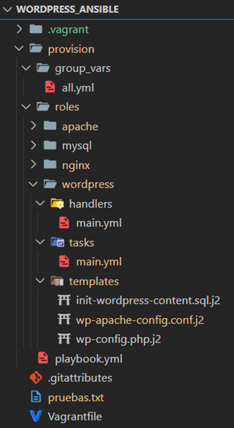

Este proyecto fue desarrollado para la asignatura de Herramientas de Atutomatización de Despliegues como parte del máster universitario oficial en Desarrollo y Operaciones (DevOps).

El objetivo principal del proyecto fue **automatizar el despliegue en local de un entorno WordPress completo** utilizando **Ansible y Vagrant**. Se implementó una arquitectura securizada optimizada mediante el uso de un **Nginx como proxy inverso** que bloquea el tráfico destinado a ciertas rutas sensibles de administración de Wordpress.

En definitiva, simplemente ubicándose en la consola en el directorio donde se encuentra el Vagrantfile y ejecutando un simple vagrant up, se despliega automáticamente un entorno WordPress funcional, personalizado y seguro, accesible desde un cliente web en http://192.168.55.10. Vagrant crea y levanta la máquina virtual, en la cual se instala Ansible. Luego, Ansible se autoaprovisiona y configura automáticamente todos los servicios necesarios, incluyendo Apache, MySQL, WordPress y Nginx, dejando el sistema completamente listo para su uso.

## Estructura general del proyecto de aprovisionamiento con Anisble

A continuación, se detalla la organización de los archivos y roles de Ansible, para facilitar la comprensión del funcionamiento general del proyecto:

### Playbook principal: provision/playbook.yml
Este archivo actúa como el punto de inicio en Ansible. Desde aquí se incluyen los roles necesarios para configurar todos los componentes del entorno.
En este caso, el código está dividido en cuatro roles: apache, mysql, wordpress y nginx, que se ejecutan en este orden.
La instalación de PHP y sus módulos se ha decidido incluir directamente en este playbook, en lugar de crear un rol separado, ya que son solo unas pocas líneas de código.
El orden de aprovisionamiento es el siguiente:
1.	Módulos de PHP
2.	Apache
3.	MySQL
4.	WordPress
5.	Nginx

### Gestión de variables con Ansible
En lugar de usar Hiera como con Puppet, en Ansible se utilizan archivos YAML dentro del directorio **group_vars/all.yml**, lo que permite separar las variables del código principal.
Esto asegura un enfoque más seguro, evitando exponer credenciales sensibles al subir el proyecto a un repositorio. Aunque este proyecto es académico y no incluye variables encriptadas, Ansible Vault permite cifrar variables si fuera necesario.
- Las variables se declaran en: group_vars/all.yml
- Se utilizan plantillas Jinja2 (.j2) para inyectar valores dinámicos en los archivos de configuración.

### Roles en Ansible

Para organizar mejor los manifiestos y ficheros auxiliares que necesita Ansible para la automatización de la configuración de la infraestructura, dividí el contenido en **cuatro roles principales en Ansible**, cada uno encargado de una parte del sistema. Esto permite **modularidad, reutilización de código y una mejor organización** del playbook.

#### Rol Apache
Con este rol, Ansible instala y configura el servidor web Apache, que actúa como backend para servir WordPress. Apache solo es accesible desde la propia máquina virtual, ya que Nginx actuará como proxy inverso.

Las principales tareas que realiza son:
- Instalar Apache y asegurarse de que el servicio esté activo.
- Eliminar la página por defecto de Apache.
- Configurar Apache para escuchar en **127.0.0.1:8080**.
  - "Configurar el puerto de escucha en 127.0.0.1:8080 significa que Apache solo aceptará conexiones desde procesos locales en la misma máquina donde se ejecuta. La dirección 127.0.0.1 es la dirección de loopback (localhost), lo que impide el acceso desde otras máquinas en la red. Esto es útil cuando Apache está detrás de un proxy inverso, como Nginx, que gestiona las conexiones externas y reenvía las solicitudes a Apache en el puerto 8080."
- Copiar la configuración personalizada desde una plantilla Jinja2 (wp-apache-config.conf.j2).
- Habilitar el nuevo sitio y reiniciar Apache automáticamente.

Con esta configuración, Apache se mantiene aislado de accesos directos, asegurando que solo pueda ser consultado a través de Nginx.

#### Rol MySQL
En este rol Ansible aprovisiona la máquina virtual de una bd MySQL para garantizar el correcto almacenamiento y acceso a los datos de WordPress. 

Las principales tareas que realiza son:
- Instalar el servidor MySQL.
- Crear la base de datos necesaria para WordPress.
- Configurar el usuario y asignarle los permisos adecuados.
- Ejecutar un script de inicialización (init-wordpress.sql.j2) para preparar la base de datos con la estructura y datos iniciales.

Este rol garantiza que la base de datos esté lista y correctamente configurada antes de que WordPress intente conectarse más adelante al ejecutar su rol.

#### Rol WordPress
Este rol automatiza la instalación y configuración de WordPress, asegurando un despliegue funcional y listo para su uso.

Las tareas clave que realiza incluyen:
- Descargar y extraer WordPress en /var/www/html/wordpress.
- Crear y configurar el archivo wp-config.php usando una plantilla (wp-config.php.j2).
- Asegurar los permisos correctos para WordPress (chown -R www-data:www-data).
- Instalar wp-cli y usarlo para configurar WordPress automáticamente.
- Inicializar la base de datos con un contenido mínimo utilizando init-wordpress-content.sql.j2.
- Configurar Apache para servir el contenido de WordPress.

Con este rol, WordPress se instala, se configura automáticamente y se deja listo para su uso, sin necesidad de ninguna intervención manual.

#### Rol Nginx
Este rol implementa Nginx como proxy inverso, formando la primera capa de defensa del sistema. Su función principal es gestionar las solicitudes entrantes y bloquear accesos no deseados.

Las principales acciones realizadas son:
- Instalar Nginx en la máquina virtual.
- Configurar Nginx como proxy inverso, redirigiendo las solicitudes a Apache en el puerto 8080.
- Bloquear el acceso a rutas sensibles como /wp-admin y /wp-login.php para aumentar la seguridad.
- Optimizar la entrega de archivos estáticos (CSS, JS, imágenes) directamente desde Nginx, mejorando el rendimiento.
- Deshabilitar la página por defecto de Nginx y habilitar una configuración específica para WordPress.
- Reiniciar Nginx automáticamente después de aplicar la configuración.

**¿Por qué es importante Nginx en este proyecto?**

Protege Apache al actuar como único punto de acceso externo, evitando ataques directos.
Mejora la seguridad bloqueando accesos a rutas críticas.
Aumenta el rendimiento sirviendo archivos estáticos sin necesidad de que Apache los procese.
Con esta configuración, Nginx filtra el tráfico y solo permite solicitudes seguras a WordPress, fortaleciendo la infraestructura del sistema.

## Arquitectura del sistema

### **Proceso de una solicitud y flujo de datos**
Cuando un usuario accede a WordPress, la solicitud sigue el siguiente flujo:

1. **El usuario accede a WordPress desde un navegador.**
2. **Nginx recibe la solicitud en el puerto 80** y decide si la bloquea o la reenvía a Apache.
3. **Si la solicitud es válida**, Nginx la reenvía a **Apache en `127.0.0.1:8080`**.
4. **Apache procesa la solicitud**, ejecutando los scripts PHP de WordPress.
5. **Si la página requiere datos de la base de datos**, Apache consulta MySQL.
6. **Apache devuelve la respuesta generada a Nginx**.
7. **Nginx envía la respuesta al usuario**.

Esto asegura que **Apache solo sea accesible desde la propia máquina**, mientras que Nginx actúa como la primera línea de defensa.

### **Comunicación entre Nginx y Apache**
Para entender mejor cómo se conectan ambos servidores, es importante conocer cómo funcionan sus **puertos e IPs**:

- **Nginx escucha en `0.0.0.0:80`**, lo que significa que acepta conexiones al puerto 80 y hacia cualquier IP que identifique la máquina que lo ejecuta.  
- **Apache escucha en `127.0.0.1:8080`**, lo que significa que con este proceso solo se pueden comunicar otros procesos desde la misma máquina y que manden tráfico a esa ip y al puerto 8080.  
  - **`127.0.0.1` es la dirección de loopback**, usada para comunicación interna dentro de la misma máquina.  
- **El tráfico externo nunca llega directamente a Apache**, ya que Nginx actúa como intermediario.

- **Beneficio clave:** Si alguien intenta acceder a Apache directamente desde otra máquina, la conexión será rechazada porque **Apache no está expuesto a la red**.
 
## Conclusión

**Repositorio de GitHub:** 
https://github.com/aleingmar/wordpress_ansible

## Vídeo de la experimentación y memoria del proyecto:
Documentación del proyecto: [**Visualizar documentación en pdf**](/post/wordpress-ansible/Act3_Wordpress_Ansible_AlejandroIngles.pdf)



